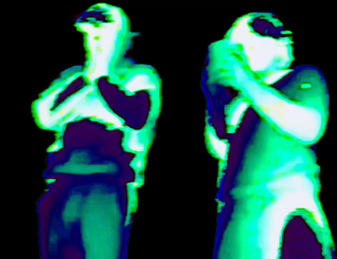
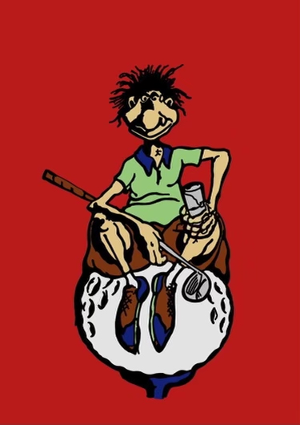
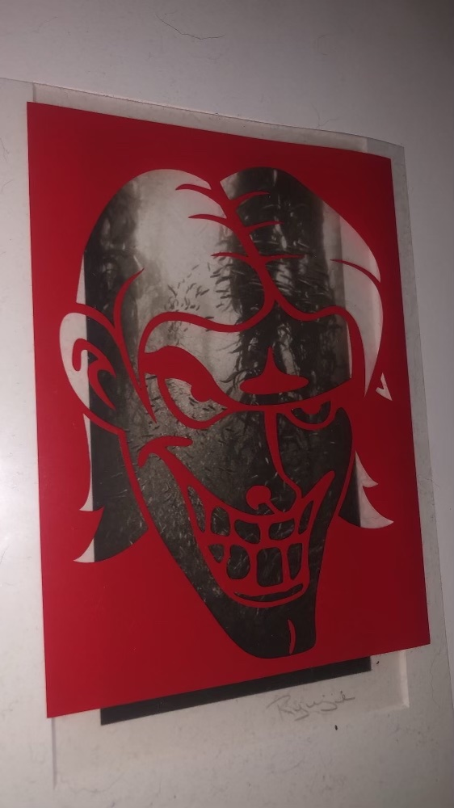
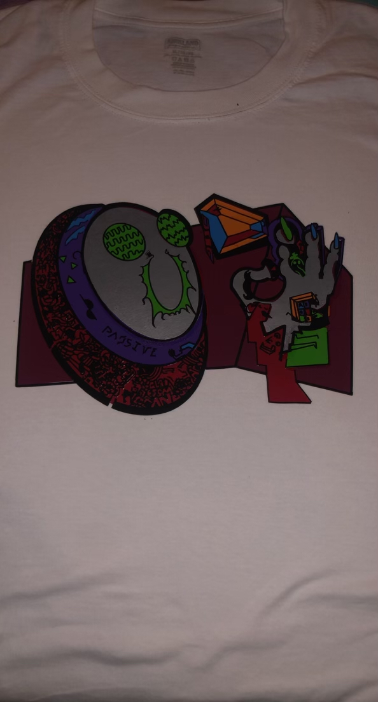
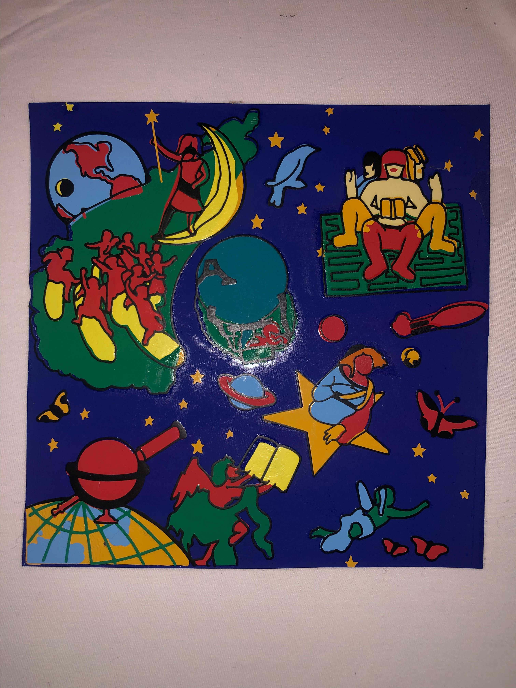
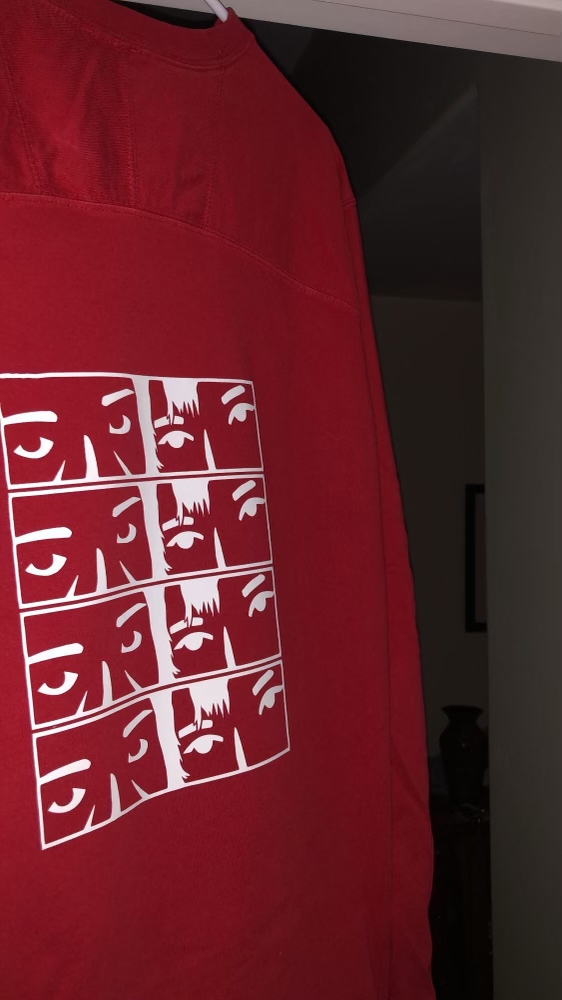
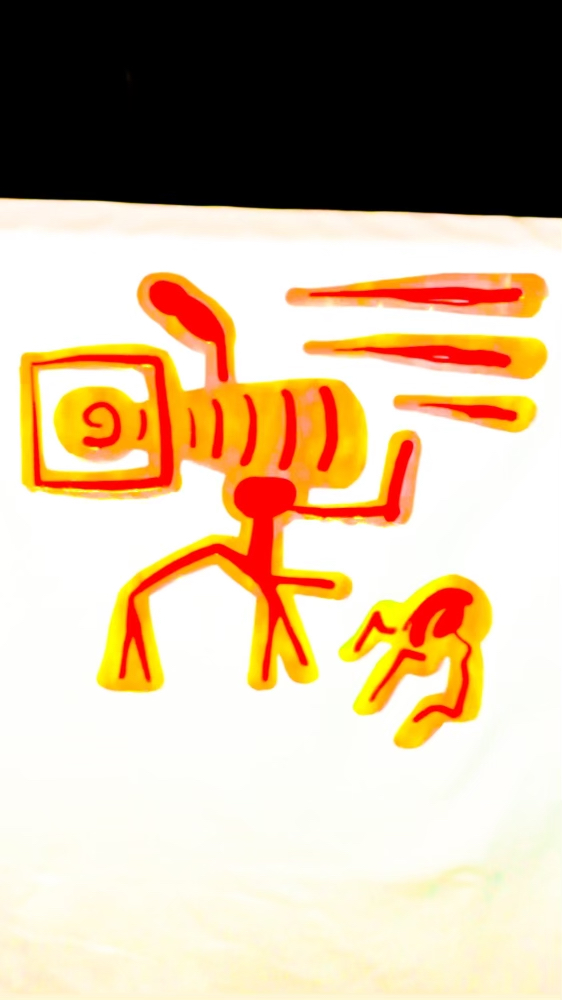

# Art
The following are some of my favorite art projects:

## CS ART!
Using [The Coding Train's Kinect and Processing3 Project](https://www.youtube.com/watch?v=QmVNgdapJJM) as base, I wrote a program to capture a subject's movements and project it back on to themselves. This project got some really cool use at a local concert. Preparation for said concert is shown below:

###### Testing thresholding and color flow:
https://user-images.githubusercontent.com/59241452/142789231-423f7dd1-ed53-4ede-bfd2-8b2e976deedc.mp4

###### Post Processing 1:

###### Post Processing 2:

## SHIRTS!
Using vector art and custom vinyl, I started making custom shirts for my wardrobe. The results follow:

###### Vector art I made for my dad:

###### Portrait of my friend:

###### [Greene & Greene](https://en.wikipedia.org/wiki/Thorsen_House) inspired shirt:

###### Design I made with my friend for a concert:

###### Testing the limit of detail in custom vinyl:

###### Shirt I made for a friend:

###### Portrait of 2 friends:

###### Abstract shirt for my friend:

